```{r setup, include=FALSE}
# library(learnr)
library(reactR)
library(npmr)
library(rmarkdown)

knitr::opts_chunk$set(echo = FALSE)
```

----------------------------------------------------------------------------------------


## Part 1. Timing in Music


### Learning Objectives

<style>div.blue { background-color:#e6f0ff; border-radius: 5px; padding: 20px;}</style>
<div class = "blue">
1. Be able to explain the meaning of time signatures 4/4, 3/4, 2/3, and 6/8 time.

2. Recognize a measure (also called a bar) on a musical score.

3. Be able to define rhythm.

4. Be able to define tempo.

5. Recognize whole, half, quarter, and eighth notes on a musical score, and know their relative time lengths.

6. Be moderately proficient at recognizing 2/4, 3/4, 4/4, and 6/8 time based on accented beats and groupings of beats.

7. Recognize a melody and be able to hum along with it.

</div>

----------------------------------------------------------------------------------------


## Time signatures and Measures

----------------------------------------------------------------------------------------


### Time signatures

<div style="color: #60c38c">**1. Be able to explain the meaning of time signatures 4/4, 3/4, 2/3, and 6/8 time**</div>

----------------------------------------------------------------------------------------

<div style="color: #00c7ac">**The most common meter is 4/4 time**</div>

Meter is a constant rhythmic pattern for a musical piece defined by...

- how many beats are in a measure
- what type of note gets one beat

----------------------------------------------------------------------------------------


### On a musical score, meter is denoted in the form of a time signature 

**time signatures** include 2/4, 3/4, 4/4, 6/8, etc...

<style>div.lightgreen { background-color:#cdf9e5; border-radius: 5px; padding: 20px;}</style>
<div class = "lightgreen">

The **numerator** is the number of beats per measure. 
The **denominator** is the type of note that gets 1 beat.

      
For example, a 4/4 time signature means 

- there are 4 beats per measure
- a quarter note gets 1 beat 


</div>


---------------------


<div style="color: #00c7ac">**If you are composing a song in 4/4 time, then you could have **</div>


- 4 quarter notes in a measure
- 1 half note + 2 quarter notes in another
- 1 whole note in another


----------------------------------------------------------------------------------------

### Measures

<div style="color: #ef9ad8">**2. Recognize a measure (also called a bar) on a musical score.**</div>

----------------------------------------------------------------------------------------


### Beats are gathered into groups called measures

<div style="color: #ff8ff8">**A beat...**</div>

is a constant pulse that guides the piece's movement in time


<div style="color: #ff8ff8">**Measures...**</div>

usually consist of 2, 3, 4, or 6 beats, on a musical score--- seperated by vertical lines


----------------------------------------------------------------------------------------


### Three measures of a musical score with time signature 4/4


<style>div.hotpink { background-color:#f396e8; border-radius: 5px; padding: 20px;}</style>
<div class = "hotpink"> First measure has 4 quarter notes

- four quarter notes = four beats 

</div>


<style>div.lpink { background-color:#fbdaf7; border-radius: 5px; padding: 20px;}</style>
<div class = "lpink">The second measure has 2 quarter notes and 1 half note

- add up to four beats -- each quarter note getting one beat and each half note getting two beats 

</div>


<style>div.llpink { background-color:#FDE5FF; border-radius: 5px; padding: 20px;}</style>
<div class = "llpink">The third measure has 4 beats

- a whole note has four beats in 4/4 time

</div>


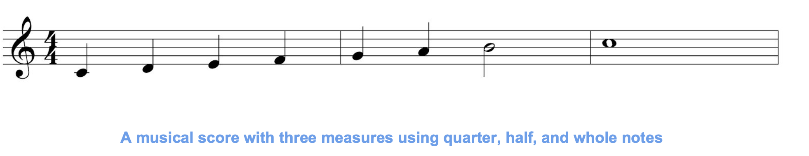{height=80%, width=80%}

**Figure 1.** A musical score with three measures using quarter, half, and whole notes


----------------------------------------------------------------------------------------

## Rhythm and Tempo

----------------------------------------------------------------------------------------


<div style="color:#2fc4e9;">**3. Be able to define rhythm.**</div>

----------------------------------------------------------------------------------------

### Rhythm is...

<style>div.lightblue { background-color:#d1ecff; border-radius: 5px; padding: 20px;}</style>
<div class = "lightblue">

A systematic arragnement of musical sounds based on the duration and accent of notes 

- usually has a pattern
- arises from the pattern of accented and unaccented notes

</div>

----------------------------------------------------------------------------------------

### Rhythm vs. Meter

               
<div style="color:#7ac8ff;">**Meter is the macro-pattern of beats and accents that remains consistent throughout the song**</div>

Once the meter is set for a section of a musical composition, the number of beats per measure must fit within that time signature


<div style="color:#7ac8ff;">**Rhythm is the micro-pattern that gives the song its individuality**</div>

Which particular types of rests and notes -- whole, half, quarter, eighth, etc. -- are chosen to add up to the number of beats per measure is up to the composer


----------------------------------------------------------------------------------------

### The Morse code

Here's an example of a simple rhythm, the Morse code for SOS


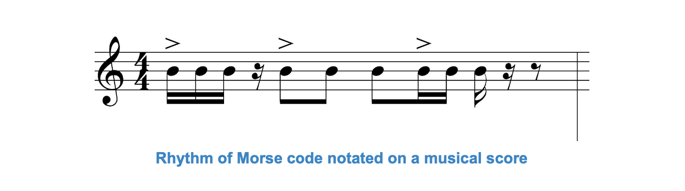{height=60%, width=60%}

**Figure 2.** The Morse code notated on a musical score -- dot, dot, dot, dash, dash, dash, dot, dot, dot

----------------------------------------------------------------------------------------

<p>&nbsp;</p>


A guitar riff is a rhythm pattern of notes that repeats throughout a song, becoming a musical theme. The notes played in the riff have a repeated rhythm that fits within the meter. 

Some rhythms are patterns of accented beats that are characteristic of a musical genre or the music of a certain culture. 

\ 

----------------------------------------------------------------------------------------


<div style="color:#8779f1;">**4. Be able to define tempo.**</div>

----------------------------------------------------------------------------------------

### Tempo is...

<style>div.purple { background-color:#e3d3fd; border-radius: 5px; padding: 20px;}</style>
<div class = "purple">

the speed of the beats in a musical piece, notated by how many beats there are in 1 minute 

for example, 60 bpm means there are 60 beats per minute 

</div>


### Changing the Tempo without changing the meter or rhythm

<style>div.lpurple { background-color:#eee5ff; border-radius: 5px; padding: 20px;}</style>
<div class = "lpurple">

changing the tempo means that the song is played faster or slower, but with 

- the same number of beats per measure
- the same type of note getting one beat
- and the same accented beats

</div>

------------------------------

<div style="color:#ad85ff;">**Tempo can be indicated...**


</div>


**numerically** at the beginning of a musical score 

- as a suggestion to the performer regarding how fast the piece should be performed


----

**both manners** of indicating tempo can be included, as shown below

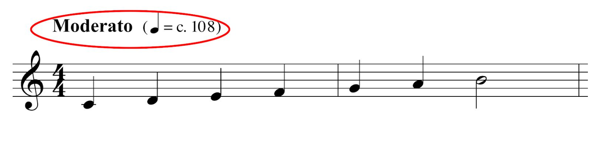{height=50%, width=50%}


----------------------------------------------------------------------------------------

## Musical score

<div style="color:#2f3fe9;">**5. Recognize whole, half, quarter, and eighth notes on a musical score, and know their relative time lengths.**</div>

----------------------------------------------------------------------------------------


### Note lengths are relative to eachother 

<style>div.bluecloud { background-color:#b3d0ff; border-radius: 5px; padding: 20px;}</style>
<div class = "bluecloud">

**If a quarter note gets 1 beat...**

- a half note gets 2 beats 
- a whole note gets 4 beats
- an eighth note gets 1/2 beats
- a sixteenth note gets 1/4 beat

</div>


----------------------------------------------------------------------------------------

### Difference between 2/4 and 4/4 time

<p>&nbsp;</p>

<div style="color:#757aff;">**In 2/4 time signature...**</div>


- there are 2 beats to a measure,
- and a quarter note gets 1 beat


<div style="color:#757aff;">**In 4/4 time signature...**</div>


- there are 4 beats to a measure, 
- and a quarter note gets 1 beat

<p>&nbsp;</p>

----------------------------------------------------------------------------------------

<div style="color:#757aff;">**In conclusion,** the difference is based on the phrasing of a song...</div>


i. If a commonly repeated sequence of notes requires only 2 beats, then it makes sense to write the song in **2/4 time**
ii. If the phrases or sequences require 4 beats, then it makes sense to write the song in **4/4 time**

\ 

----------------------------------------------------------------------------------------

### Accented beats 

<div style="color:#fa4273;">**6. Recognize 2/4, 3/4, 4/4, and 6/8 time based on accented beats and groupings of beats.**</div>

----------------------------------------------------------------------------------------


#### Which beat is accented

<style>div.orange { background-color:#ffecb3; border-radius: 5px; padding: 20px;}</style>
<div class = "orange">


**Accented** beats are called *strong beats*

**Unaccented** beats are called *weak beats*

</div>

<style>div.lorange { background-color:#fff5d6; border-radius: 5px; padding: 20px;}</style>
<div class = "lorange">

Detecting the meter of the song requires listening for...

- the grouping of beats 
- determining which beat is **accented**

</div>


<p>&nbsp;</p>

<div style="color:#fa4273;">**it is most common in 4/4 meter that...**</div>


- the 1st beat in a measure is the accented one
- and the 3rd beat slightly accented, as shown in the figure below


{height=30%, width=30%}


*some rhythms are patterns of accented beats that are characteristic of a musical genre or the music of a certain culture*

----------------------------------------------------------------------------------------

#### Difference between 3/4 and 6/8 time

the difference lies in the way eighth notes are grouped

--------------------------------------------------------

<style>div.redlove { background-color:#fa4273; border-radius: 5px; padding: 20px;}</style>
<div class = "redlove">
<div style="color:#fff5f9;">**In 3/4 time signature...**</div>

</div>

<p>&nbsp;</p>

there are 3 beats to a measure, and a quarter note gets 1 beat

- 3 quarter notes equal 6 eighth notes
- there are 2 eighth notes in 1 beat
- the eighth notes are in 3 groups of 2 notes each, as shown below


<div style="color:#ffaa42;">**The accent in 3/4 meter is on...** </div>

the 1st beat (eighth note) in the measure, with a lighter accent on the 3rd and 6th eighth notes


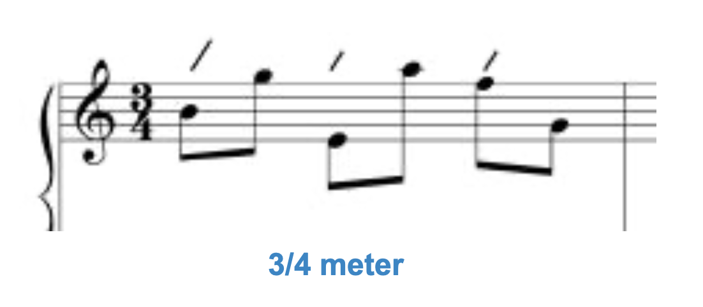{height=40%, width=40%}


---------------------------------------------------------------


<style>div.redlove { background-color:#fa4273; border-radius: 5px; padding: 20px;}</style>
<div class = "redlove">
<div style="color:#fff5f9;">**In 6/8 time signature...**</div>

</div>

<p>&nbsp;</p>

there are 6 beats to a measure, and an eighth note gets 1 beat

- 6 eighth notes equals 6 beats
- 3 quarter notes equals 6 beats
- eighth notes are in 2 groups of 3


<div style="color:#ffaa42;">**The accent in 6/8 meter...** </div>

falls on the 1st and 4th eighth notes, the second accent being lighter than the first


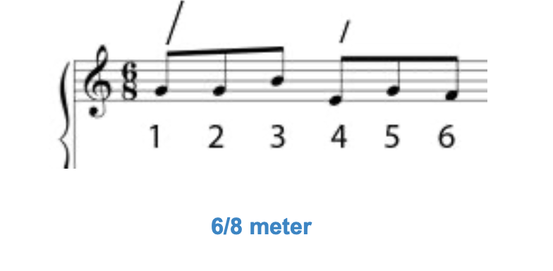{height=40%, width=40%}


----------------------------------------------------------------------------------------

#### In conclusion...

<style>div.lorange { background-color:#fff5d6; border-radius: 5px; padding: 20px;}</style>
<div class = "lorange">

When comparing a sequence of 6 eigth notes in 3/4 time and 6/8 time, the accents fall in different places. 

For 3/4 time, the accents fall on the 1st, 3rd, and 5th eighth notes in a sequence of 6.
    
In 6/8 time they fall on the 1st and 4th eighth notes.


</div>


----------------------------------------------------------------------------------------


## Part 2. Patterns and Form

----------------------------------------------------------------------------------------


### Learning Objectives

<p>&nbsp;</p>

<style>div.blue { background-color:#e6f0ff; border-radius: 5px; padding: 20px;}</style>
<div class = "blue">

1. Recognize a melody and be able to hum along with it.

2. Distinguish among monophonic, polyphonic, homophonic, and heterophonic music.

3. List the names and scale degrees of notes in a major diatonic scale.

4. Give examples of tendency notes and common melodic cadences and chord
progressions.

5. Be able to give basic definitions of inversion, retrograde, or inverted retrograde as
transformations of a melody.

6. Recognize a sequence in a melody.

7. Know the most common chord progressions in contemporary popular and jazz music, by
chord numbers.

8. Know how the form of a song can be described by using capital letters A, B, C, ....

9. Know that AABA is referred to as song form, and what this means in terms of sections in
the song's structure.

10. Be able to hear and describe the form of simple songs.

11. Know that 8-bar and 12-bar sections are commonly used in contemporary pop music,
jazz, and the blues.

12. Know that the I IV V I and vi ii V I chord progressions are commonly used in pop, blues,
and jazz music.

</div>


----------------------------------------------------------------------------------------

## Melody

<div style="color: #60c38c">**1. Recognize a melody and be able to hum along with it.**

</div>

<div style="color: #60c38c">**2. Distinguish among monophonic, polyphonic, homophonic, and heterophonic music.**

</div>


----------------------------------------------------------------------------------------

<div style="color: #00c7ac">**A Melody is**</div>

- a "rhythmic succession of single tones organized as an aesthetic whole"
- often thought of as the singable or hummable line of a song

----------------------------------------------------------------------------------------


### Melodic Texture


the word "texture" is used to describe how melodies and harmonies are combined in a musical composition


----------------------------------------------------------------------------------------

<style>div.lightgreen { background-color:#cdf9e5; border-radius: 5px; padding: 20px;}</style>
<div class = "lightgreen">
**Monophony**</div>

- the simplest type of texture, which is a single melody in a piece of music
- could be a "tune" sung by a single person or played by a single instrument, or the melody could be played by multiple singers or instruments at the same time


----------------------------------------------------------------------------------------

<style>div.lightgreen { background-color:#cdf9e5; border-radius: 5px; padding: 20px;}</style>
<div class = "lightgreen">
**Polyphony**</div>

- contains two or more melodic lines at the same time, four being the norm
- Johann Sebastian Bach
  - composer during 1700s Baroque period of music
  - his fugues and canons have multiple lines of melody that blend harmonically in intricate patterns

----------------------------------------------------------------------------------------

<style>div.lightgreen { background-color:#cdf9e5; border-radius: 5px; padding: 20px;}</style>
<div class = "lightgreen">
**Heterophony**</div>

- uses simultaneous melodic variants of the same tune
- typical of Middle Eastern music
- in Persian art music, instrumentalists play variants of the singer's lines 

----------------------------------------------------------------------------------------

<style>div.lightgreen { background-color:#cdf9e5; border-radius: 5px; padding: 20px;}</style>
<div class = "lightgreen">
**Homophony**</div>


- standard in Western music and contemporary music
- consists of a melody with harmonic accompaniment
- for examplpe, the saxophone has the lead and is accompanied by other instruments
- occurs in music other than vocal music


----------------------------------------------------------------------------------------


## Note Scale Degrees

<div style="color: #ff5cff">**3. List the names and scale degrees of notes in a major diatonic scale.**</div>

----------------------------------------------------------------------------------------


### Simple melodies

constructed primarily from the notes of the diatonic scale in the chosen key

building a musical composition on the **diatonic scale** is a way to help direct the motion of the melody and harmony

----------------------------------------------------------------------------------------

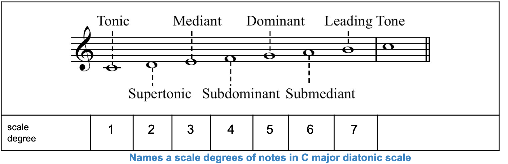{height=50%, width=50%}


**Figure 1.** Names a scale degrees of notes in the key of C of a major diatonic scale


<p>&nbsp;</p>


### Diatonic Scale

<div style="color: #ff5cff">**There are 7 notes in a diatonic scale:**</div>

building a musical composition on the **diatonic scale** is a way to help direct the motion of the melody and harmony; notes can be identified as scale degrees 1-7

----------------------------------------------------------------------------------------

<style>div.lightpink { background-color:#ffe5ff; border-radius: 5px; padding: 20px;}</style>
<div class = "lightpink">**Scale degree 1 is the tonic**</div>

- note that an octave above is also considered the tonic

----------------------------------------------------------------------------------------

<style>div.lightpink { background-color:#ffe5ff; border-radius: 5px; padding: 20px;}</style>
<div class = "lightpink">**Scale degree 5 is called dominant**</div>

- because it has such a strong pull toward the tonic
- dominant is an interval of a fifth from the tonic

----------------------------------------------------------------------------------------

<style>div.lightpink { background-color:#ffe5ff; border-radius: 5px; padding: 20px;}</style>
<div class = "lightpink">**Scale degree 4 is the subdominant**</div>

- subdominant is an interval of a fifth below the tonic
- a semitone away from scale degree 3 (the mediant)

----------------------------------------------------------------------------------------

<style>div.lightpink { background-color:#ffe5ff; border-radius: 5px; padding: 20px;}</style>
<div class = "lightpink">**Scale degree 3 is the mediant**</div>

- mediant is halfway between the tonic and the dominant
- is a third above the tonic, and the submediant is a third below the tonic

----------------------------------------------------------------------------------------

<style>div.lightpink { background-color:#ffe5ff; border-radius: 5px; padding: 20px;}</style>
<div class = "lightpink">**Scale degree 2 is the supertonic**</div>

- supertonic is directly above the tonic

----------------------------------------------------------------------------------------

<style>div.lightpink { background-color:#ffe5ff; border-radius: 5px; padding: 20px;}</style>
<div class = "lightpink">**Scale degree 7 is called the leading tone**</div>

- because it is pulled so strongly toward the note a semitone away
- leading tone is directly below the tonic

----------------------------------------------------------------------------------------

<p>&nbsp;</p>


**Example.** scale up to scale degree 7 and stop in the key of C

    that would be C, D, E, F, G, A, B 

    the movement from the leading tone to the tonic (B to C in the key of C) gives a perception of closure -- either stopping or pausing


----------------------------------------------------------------------------------------


## Tendency Tones

<div style="color: #424fff">**4. Give examples of tendency notes and common melodic cadences and chord progressions.**</div>

----------------------------------------------------------------------------------------

### Tendency Tones

<style>div.lightpurp { background-color:#bdc1ff; border-radius: 5px; padding: 20px;}</style>
<div class = "lightpurp">

certain tones in the diatonic scale that have a tendency to move to (or be followed by) certain other tones 

this is the basis of what is called tonal music or tonality 

tonal tendencies create points of tension and release as the music moves through time


</div>

----------------------------------------------------------------------------------------


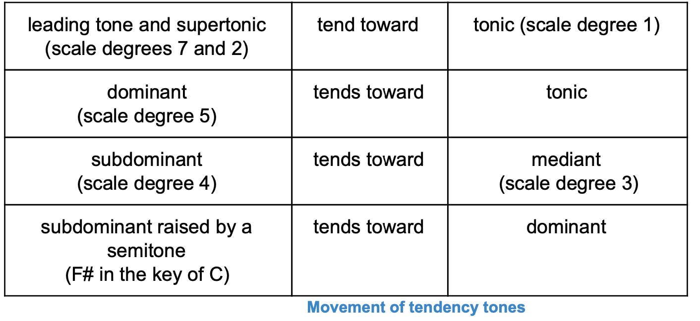{height=50%, width=50%}


**Figure 2.** Movement of Tendency Tones


Scale degree 4 (subdominant) is a semitone away from scale degree 3 (mediant), "leaning into" the mediant; when a note is on the subdominant, it seems natural to move to the mediant 


**Exercise**

```
Play C, D, E, and F

Then play C, D, E, F, and E 

Does the second sequence sound more "finished" to you than the first? 

Now raise scale degree 4 by a semitone, which in the key of C gives you an F#

This note is pulled strongly toward scale degree 5, which is G in the key of C
```

----------------------------------------------------------------------------------------


### Melodic Cadences

<style>div.lightpurp { background-color:#bdc1ff; border-radius: 5px; padding: 20px;}</style>
<div class = "lightpurp">


the feeling of finality or completion that comes from moving from one note to another is called melodic resolution (also called melodic cadence)


</div>

----------------------------------------------------------------------------------------

<div style="color: #424fff">**A melody written with classic tonality**</div>

begins with the tonic
moves away from the tonic and creates tension
arrives either at the leading tone or at the submediant
and resolves the tension by finally moving back to the tonic


to practice tonality, you should make your melody end either on the supertonic moving to the tonic, or on the leading tone moving to the tonic


<p>&nbsp;</p>

----------------------------------------------------------------------------------------

**In Conclusion,**

notes in a major diatonic scale have names that relate to their positions in the scale and their **tonal tendencies**

example of a song ending on leading tone, tonic; the leading tone is an octave below scale degree 7, but it is still a leading tone: "Minuet in G" by Bach, ending in leading tone to tonic

<p>&nbsp;</p>

----------------------------------------------------------------------------------------

<div style="color: #424fff">**Melodic Contour**</div>

a melody has a contour based on how the pitches go up and down 

the contour of a melody arises in part from the conjunctive and disjunctive moves in a melody 

<style>div.lightpurp { background-color:#bdc1ff; border-radius: 5px; padding: 20px;}</style>
<div class = "lightpurp">

**conjunctive move** is a step from one note to a neighboring note in the tonal collection

**disjunctive move** is a move from one note to a non-neighboring note

</div>

the greater the distance between one note and another, the more attention is called to that move

----------------------------------------------------------------------------------------

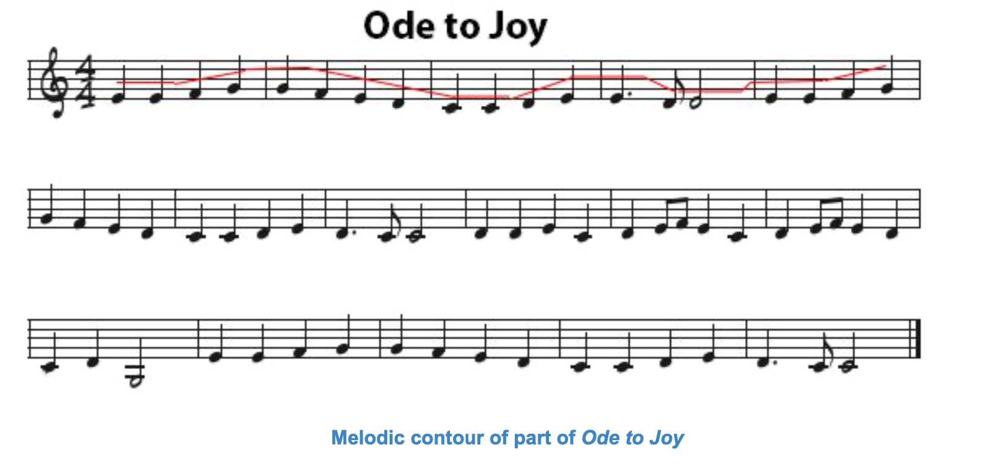{height=50%, width=50%}

**Figure 3.** Tracing the melodic contour of Ode to Joy


in this piece, you can hear disjunctive moves and (mostly) conjunctive moves; the disjunctive moves tend to stand out more


-----------------------------------------------------------------------------------------------


## Transformations and Sequences

----------------------------------------------------------------------------------------


### Melody Transformations

<div style="color: #0a9dff">**5. Be able to give basic definitions of inversion, retrograde, or inverted retrograde as transformations of a melody.**</div>

----------------------------------------------------------------------------------------

#### Melodic Variations

to achieve a melodic variation, we use specific techniques, which work by a kind of algorithm, called **melodic transformations**

<style>div.lightblue { background-color:#c7e9ff; border-radius: 5px; padding: 20px;}</style>
<div class = "lightblue"> Melodic variation is a technique in which an existing melody or theme is repeated and embellished with one or more changes: changing the rhythm or harmony, or adding or changing existing material
</div>

<p>&nbsp;</p>

**Three types of melodic transformation:**

----------------------------------------------------------------------------------------

<div style="color: #0a9dff">**Inversion**</div>

ascending intervals are changed to descending ones and vice versa

also possible to have an approximate inversion, where the direction is inverted but not the exact number of steps

----------------------------------------------------------------------------------------

Figures below show an **Exact Inversion**

i. first, 2 measures of a melody are shown, with the semitone steps indicated in the table below it

ii. then the inverted melody is shown, with the semitone steps in the table


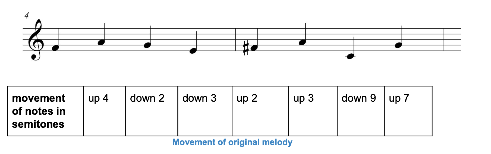{height=50%, width=50%}

**Figure 5.** Movement of original melody


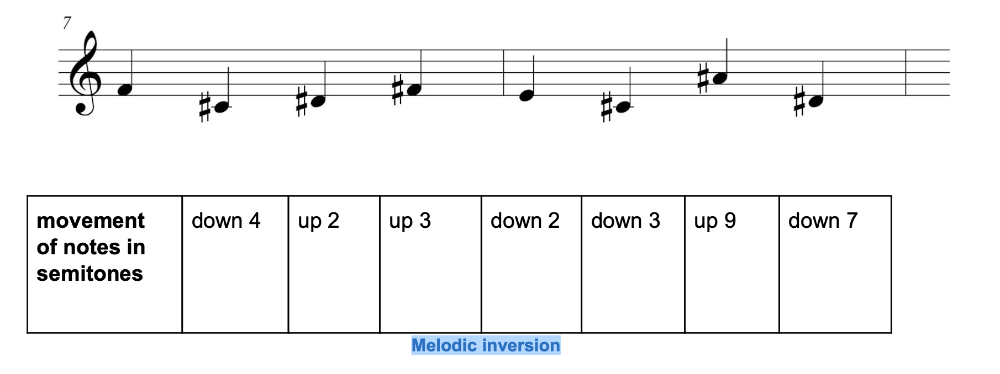{height=50%, width=50%}


**Figure 6.** Melodic inversion

<p>&nbsp;</p>

----------------------------------------------------------------------------------------

<div style="color: #0a9dff">**Retrograde**</div>

notes are played in reverse order


----------------------------------------------------------------------------------------

<div style="color: #0a9dff">**Inverted Retrograde**</div>

the inverted melody is played back in reverse order

----------------------------------------------------------------------------------------

<div style="color: #0a9dff">**Timing Changes**</div>

one or more notes in a sequence are made longer or shorter in time


----------------------------------------------------------------------------------------


### Melody Sequence

<div style="color: #0042eb">**6. Recognize a sequence in a melody.**</div>

----------------------------------------------------------------------------------------

#### Segments of a Melody

patterns such as **sequences** and **phrases** are an important part of music

----------------------------------------------------------------------------------------

#### Sequence

<style>div.lightblue { background-color:#c7e9ff; border-radius: 5px; padding: 20px;}</style>
<div class = "lightblue">
a small melodic group of notes -- as few as two -- that can be used repeatedly in a melody, but at different pitch levels higher or lower than the original

repetitions of the sequence can have exactly the same contour as the original, or they can be varied slightly

</div>

----------------------------------------------------------------------------------------

**Example.** Contour of the melody helps to reveal that the following is a sequence

First 4 notes have a contour in the way they go up and down, and this contour is repeated at successively lower pitches in the second and third measures

These 4 notes constitute a sequence

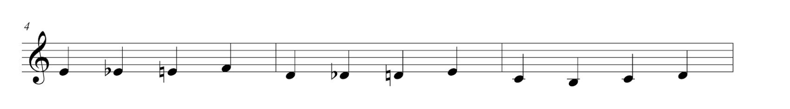{height=50%, width=50%}

**Figure 4.** Sequence in Saint Saens "Aquarium"

<p>&nbsp;</p>

----------------------------------------------------------------------------------------

#### Phrase

<style>div.lightblue { background-color:#c7e9ff; border-radius: 5px; padding: 20px;}</style>
<div class = "lightblue">


a phrase in music is a recognisable musical unit, generally ending in a cadence of some kind, and forming part of a period or sentence 

phrasing in performance indicates the correct grouping of notes, whether as phrases in the technical sense or in smaller distinct units, corresponding to the various possible syntactical uses of punctuation
</div> 

----------------------------------------------------------------------------------------

**Example.** Beethoven's "Ode to Joy" is divided into 4 phrases, each 4 bars long 

<div style="color: #0042eb">**Phrase 1**</div>

- serves as an antecedent
- doesn't sound finished because it ends on a tendency note in the key of C -- the note D
- D wants to move back to the tonic note C, and since the section ends on D, we feel "left hanging" 


<div style="color: #0042eb">**Phrase 2**</div>

-  does end on C (we're home again)
- phrase 2 is the consequent of phrase 1

<div style="color: #0042eb">**Phrase 3**</div>

- different from Phrases 1 and 2


<div style="color: #0042eb">**Phrase 4**</div>

- repetition of the Phrase 2
- wrapping up this section


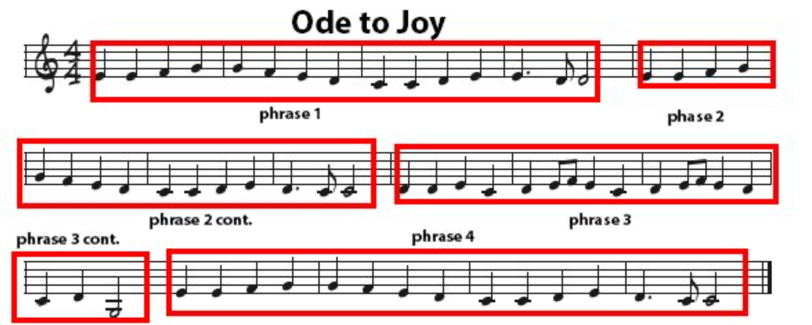{height=30%, width=30%}

**Figure 5.** Phrases, antecedents, and consequent in Beethoven's Ode to Joy

<p>&nbsp;</p>


----------------------------------------------------------------------------------------


## Common Chord Progressions

<div style="color: #00946f">**7. Know the most common chord progressions in contemporary popular and jazz music, by chord numbers.**</div>

----------------------------------------------------------------------------------------

In modern music, a melody is generally accompanied by harmony in the form of chord progressions:

i. how chords are built

ii. and the way in which chords have tendencies just like notes have tendencies in a melody

----------------------------------------------------------------------------------------

### Harmony

a melody consists of single notes, one after another, movement that is shown in a horizontal direction on a musical score

Harmony...

<style>div.lightlightgreen { background-color:#b8ffed; border-radius: 5px; padding: 20px;}</style>
<div class = "lightlightgreen"> 

involves 2 or more notes played at the same time, as in triad chords

appears vertically on a musical score, with notes stacked on top of each other to be played simultaneously</div>


<p>&nbsp;</p>

----------------------------------------------------------------------------------------


### Tertian Harmony

Tertian chords...

<style>div.lightlightgreen { background-color:#b8ffed; border-radius: 5px; padding: 20px;}</style>
<div class = "lightlightgreen">  

created by playing notes separated by intervals of a third -- usually 3 or 4

provide tertian harmony

examples of tertian chords (both "triad" and "tertian" have prefixes meaning "3")</div>


<p>&nbsp;</p>

----------------------------------------------------------------------------------------


### Functional Harmony

Functional harmony...

<style>div.lightlightgreen { background-color:#b8ffed; border-radius: 5px; padding: 20px;}</style>
<div class = "lightlightgreen"> 

is the tendency for one chord to move to another one (also called tonal)

tonality applies to both melody and harmony:

like notes in a major diatonic scale, chords in a key have tendencies toward each other</div>

----------------------------------------------------------------------------------------

As described in the section on melody, **tonality** in music is based on the perception that certain notes pull naturally toward certain other notes

<div style="color: #00946f">**In a tonal system,**</div> 
the note that pulls most strongly is the tonic note, where the song generally begins and ends
the tonic note is the "home note"


----------------------------------------------------------------------------------------


<div style="color: #00946f">Like notes...</div>

i. chords are numbered according to their scale degree, but using Roman numerals

ii. chords also have names derived from their bottom note -- C major, D minor, E minor, etc

iii. in a major diatonic scale, chords are named according to their tendencies relative to other chords

----------------------------------------------------------------------------------------

### Chord names based on scale degree:


<style>div.lightlightgreen { background-color:#b8ffed; border-radius: 5px; padding: 20px;}</style>
<div class = "lightlightgreen"> 

Chord I is the tonic

Chord II is the supertonic

Chord III is the mediant

Chord IV is the subdominant (also called the predominant)

Chord V is the dominant

Chord VI is the submediant

Chord VII is the leading chord

</div>

----------------------------------------------------------------------------------------


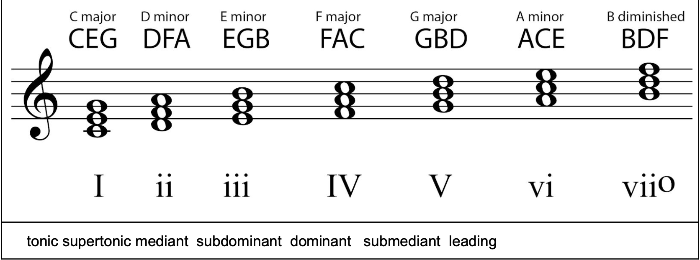{height=50%, width=50%}


**Figure 7.** Triad chords in the key of C major, named and numbered


*Note, in the tutorial's first figure, we see notes in the C major diatonic scale numbered according to scale degree*


<p>&nbsp;</p>

----------------------------------------------------------------------------------------

### The Dominant Seventh Chord

so far, we've looked at triads -- chords with 3 notes 

Four-note chords...

<style>div.lightlightgreen { background-color:#b8ffed; border-radius: 5px; padding: 20px;}</style>
<div class = "lightlightgreen"> 

the dominant 7th is one of the most frequently used 

most common in jazz and blues music

all dominant seventh chords contain 4 notes</div>

----------------------------------------------------------------------------------------

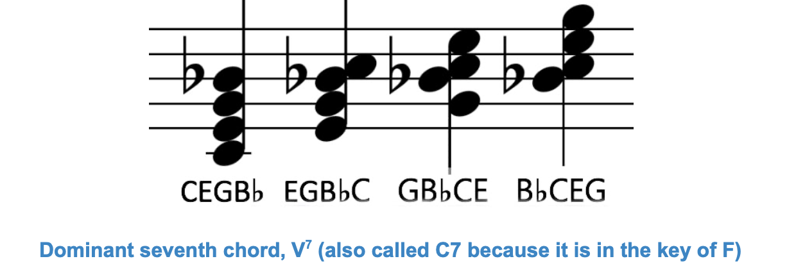{height=50%, width=50%}


**Figure 8.** Dominant seventh chord


----------------------------------------------------------------------------------------

<div style="color: #00946f">Other dominant seventh chords:</div>

i. minor/major seventh

ii. half-diminished seventh

iii. fully diminished seventh

iv. augmented major seventh

v. augmented seventh

----------------------------------------------------------------------------------------

### Chord Cadences, Chord Progressions, and Harmonic Resolution


Returning to the concept of **functional harmony**...


----------------------------------------------------------------------------------------

A cadence...

<style>div.lighttblue { background-color:#a8fbff; border-radius: 5px; padding: 20px;}</style>
<div class = "lighttblue">

is a melodic and/or harmonic progression that creates a sense of completion, called resolution

similar a comma or a period in a sentence

function can be to slow down a melody or section of music, end it, or prepare for a transition to more musical material</div>

----------------------------------------------------------------------------------------

A melodic cadence...

<style>div.lighttblue { background-color:#a8fbff; border-radius: 5px; padding: 20px;}</style>
<div class = "lighttblue">
consists of at least 2 notes</div>

----------------------------------------------------------------------------------------

A harmonic cadence 

<style>div.lighttblue { background-color:#a8fbff; border-radius: 5px; padding: 20px;}</style>
<div class = "lighttblue">
consists of at least 2 chords that bring a section of music to a close or a pause

can also be called a chord cadence</div>


----------------------------------------------------------------------------------------


## Form of a Song

<div style="color: #ff7f0f">**8. Know how the form of a song can be described by using capital letters.**</div>

<div style="color: #ff7f0f">**9. Know that AABA is referred to as song form, and what this means in terms of sections in the song's structure.**</div>


----------------------------------------------------------------------------------------

### Tonal Music

most of the discussion above has been based upon tonal music

In tonal music... 

<style>div.orange { background-color:#ffe4cc; border-radius: 5px; padding: 20px;}</style>
<div class = "orange">
songs are written in a particular key that defines a tonal center, and tension is created and resolved as the melody or chords move away from and return to the tonal center

</div>


### Atonality

Atonal music, on the other hand, 

<style>div.orange { background-color:#ffe4cc; border-radius: 5px; padding: 20px;}</style>
<div class = "orange">
is purposely composed without a tonal center (no key) 

this genre of music rose in prominence at the beginning of the 20th century with composers such as Arnold Schoenberg and Anton Webern

</div>

<p>&nbsp;</p>

----------------------------------------------------------------------------------------

### Form of a Musical Composition

<div style="color: #ff7f0f">**Analyzing Musical Form with ABCs**</div>


Annotating musical compositions, the **letter**...

<style>div.orange { background-color:#ffe4cc; border-radius: 5px; padding: 20px;}</style>
<div class = "orange">

A stands for a cohesive phrase or phrases or longer segment of music--a section of a certain nature, determined primarily by the melodic and harmonic progression in that part

B stands for a contrasting cohesive phrase or phrases -- a section or with a different melody or harmony. The bottom line for this section is for you to "hear" the changes in sections -- like paragraphs in music

</div>

----------------------------------------------------------------------------------------


### AABA Form

A common form for pop and jazz songs -- actually known as song form -- is AABA 

<style>div.orange { background-color:#ffe4cc; border-radius: 5px; padding: 20px;}</style>
<div class = "orange">

this form consists of 4 sections, each 8 measures long

it can also be called the 32-bar form

</div>


**AABA Example.** "Deck the Halls" in the AABA form

A: Deck the halls with boughs of holly, fa la la la la la la la la

A: Tis the season to be jolly, fa la la la la la la la la

B. Don we now our gay apparel, fa la la la la la la la la

A: Troll the ancient yuletide carol, fa la la la la la la la la


<p>&nbsp;</p>

----------------------------------------------------------------------------------------


There can be differences of opinion in analyzing the form of a song; some might say A and A' are the same, which would make this form AABA; others might say the first and second phrases are different and call the form ABCB

**overall idea is that phrases are not randomly different from each other**


----------------------------------------------------------------------------------------

### Simple Songs

<div style="color: #ff0a50">**10. Be able to hear and describe the form of simple songs.**</div>


----------------------------------------------------------------------------------------

#### Verse/Chorus Form


<style>div.lightred { background-color:#ffadc5; border-radius: 5px; padding: 20px;}</style>
<div class = "lightred">

standard song form built around 2 repeating and alternating sections

form commonly consists of **verse, chorus** (with more verse/chorus pairs)

variation of the verse/chorus form is **verse, chorus, verse, chorus, bridge, chorus**

</div>


----------------------------------------------------------------------------------------


<div style="color: #ff0a50">Repeated Verses</div> 

- usually all have the same melody
- but they have different lyrics from one verse to the next


<div style="color: #ff0a50">Chorus</div>

- on the other hand, generally has the same words and music in each repetition
- contains the song's melodic motifs and lyrical refrains
- usually the most memorable part of the song


<div style="color: #ff0a50">Bridges</div>

- are a section of the song that provides a musical contrast to the rest
- may have a key, meter, or tempo change, or different chord progressions


----------------------------------------------------------------------------------------


To give the song coherence, the chorus returns to the original musical and lyrical themes at the end. Structure can get even more complicated, as in Coldplay's song "Fix You" which contains *verse-verse-chorus-verse-chorus-bridge-bridge-chorus*


\ 

----------------------------------------------------------------------------------------


### 8-bar and 12-bar Sections

<div style="color: #ff75e3">**11. Know that 8-bar and 12-bar sections are commonly used in contemporary pop music, jazz, and the blues.**</div>

----------------------------------------------------------------------------------------


#### 12-bar


The Blues form...

<style>div.lightyellow { background-color:#ffd6f7; border-radius: 5px; padding: 20px;}</style>
<div class = "lightyellow">

is another standard form of chord progression

uses 12-bar sections with a lot of repetition of chord progressions

relying heavily on the I IV V7 I chord progression

</div>


----------------------------------------------------------------------------------------

<div style="color: #ff75e3">**Here's a common progression for 12-bar blues...**</div>


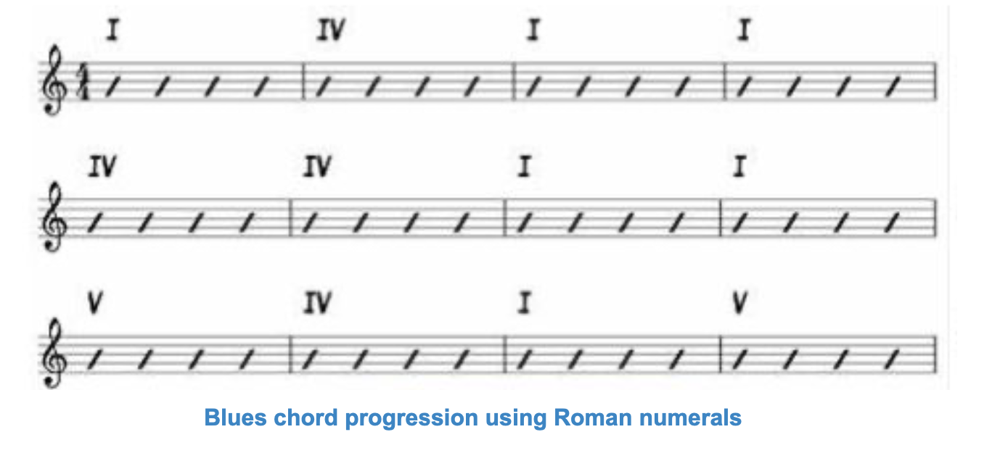{height=50%, width=50%}

**Figure 11.** Blues chord progression using Roman numerals


----------------------------------------------------------------------------------------


<div style="color: #ff75e3">**Here's a different blues chord progression in the key of C...**</div>


Notated with lettered chord names rather than by Roman numerals

i. this type of chord notation is called a **lead sheet**

ii. example is different from the previous one because second measure is a I chord rather than a IV

iii. C chord (CEGB) and the F chord (FACE), as 4-note chords, have 2 common tones -- C and E


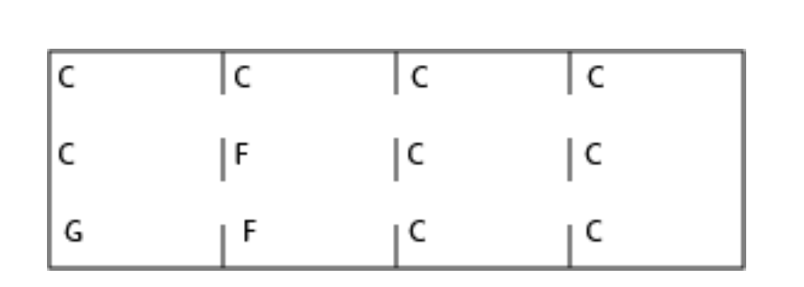{height=50%, width=50%}

**Figure 12.** Lead sheet for a blues chord progression


----------------------------------------------------------------------------------------


<div style="color: #ff75e3">**Following examples show dominant 7th chords used in blues chord progressions...**</div>


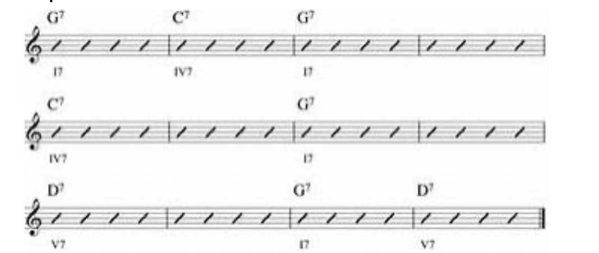{height=50%, width=50%}

**Figure 13.** Lead sheet for a blues chord progression with all chords being dominant 7th chords


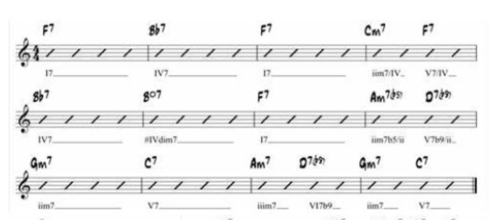{height=50%, width=50%}

**Figure 13b.** Lead sheet symbols for blues chord progressions in the key of F with a few added chords for decoration


----------------------------------------------------------------------------------------

### I IV V I Chord Progression

<div style="color: #00aeb8">**12. Know that the I IV V I and vi ii V I chord progressions are commonly used in pop, blues, and jazz music.**</div>

----------------------------------------------------------------------------------------


A sequence...

<style>div.lighttblue { background-color:#a8fbff; border-radius: 5px; padding: 20px;}</style>
<div class = "lighttblue">
A sequence of more than two chords is called a chord progression

Common chord progression is **I IV V I**</div>


i. common in Classical music, contemporary popular music, and the blues

ii. most contemporary popular music uses primarily the I IV V I progression

----------------------------------------------------------------------------------------


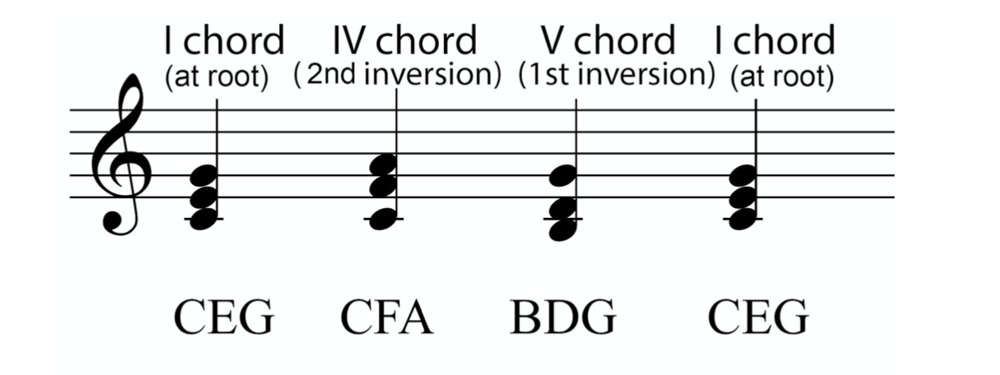{height=50%, width=50%}

**Figure 9.** I IV V I chord progression

----------------------------------------------------------------------------------------

<div style="color: #00aeb8">Voice Leading</div>

Why didn't we put chords in root position, in which notes are a 3rd apart?

- want to have notes that are common between chords, and notes that move by only a step
- the way a note moves to the following note
- notice how the D goes up to the E and the B resolves to the C in the V-I progression *as shown by the arrows*


----------------------------------------------------------------------------------------


#### Chord Ladder

How chords relate to each other in a sequence that goes from a leading chord, through various types of musical tension, to resolution at the tonic:


<style>div.lighttblue { background-color:#a8fbff; border-radius: 5px; padding: 20px;}</style>
<div class = "lighttblue">

Chords V and vii tend to be followed by I or vi

Chords ii and IV tend toward V or vii

Chord vi tends toward chords ii or IV

Chord iii tends toward vi</div>

----------------------------------------------------------------------------------------


<div style="color: #00aeb8">Method to find a chord progression that follows functional harmony...</div>

i. start anywhere in the ladder and move down 

ii. or start on I, then move to anywhere in the ladder and go down from there


----------------------------------------------------------------------------------------

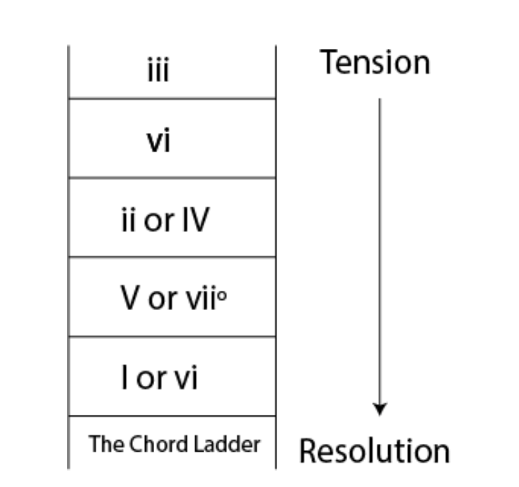{height=50%, width=50%}


**Figure 10.** Chord Ladder showing common chord progressions moving through time


----------------------------------------------------------------------------------------


**Chord progression I IV V I** is in keeping with functional harmony


More chord progressions you can derive from the ladder are...

a. **ii V I**

b. **vi ii V I**

these are the most common chord progressions in jazz


----------------------------------------------------------------------------------------

<div style="color: #00aeb8">**Notice in the chord ladder** that there are rows where you have a choice between 2 chords in the chord progression...</div>

i. ii and IV, V and vii, and I and VI
ii. these pairs of chords can "substitute for" each other
iii. each of these pairs of chords have 2 common notes
iv. this gives them a similarity which makes them interchangeable

----------------------------------------------------------------------------------------


Not all popular chord progressions follow the Chord Ladder

Varying slightly is **I V vi IV I**

- a chord progression used by the Beatles "Let it Be"
- the root of each chord descends by a fifth


<p>&nbsp;</p>

----------------------------------------------------------------------------------------

## References 
